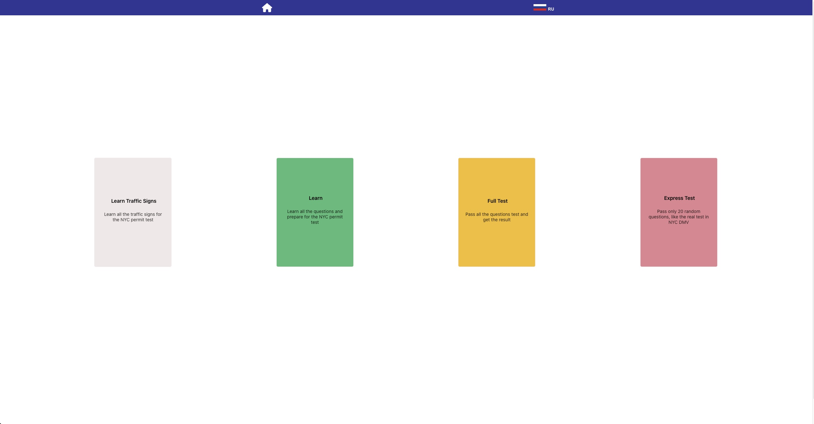
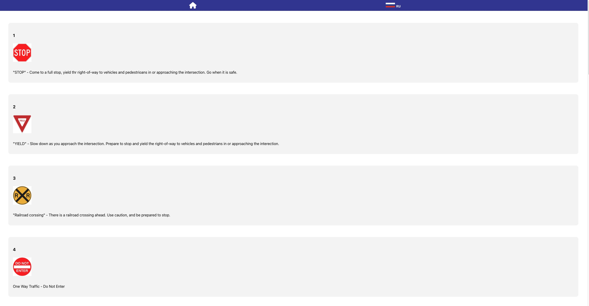
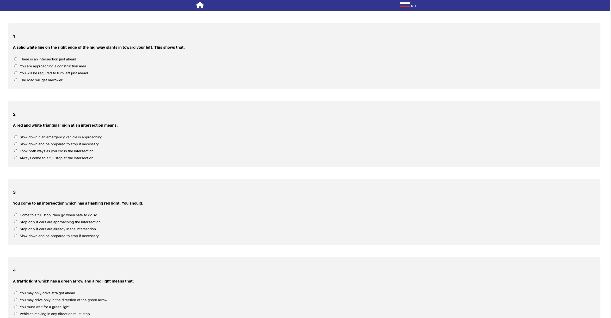
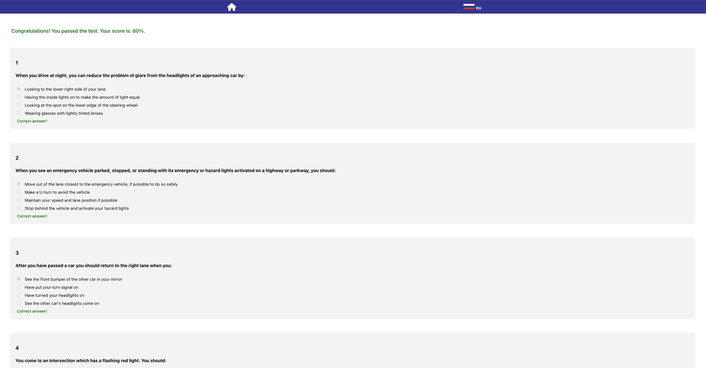

# NYC DMV Driver Permit Website

Welcome to the NYC Practice Permit Test project! This web application is designed to help individuals prepare for their New York City driver's permit test by providing a platform to practice answering questions similar to those on the actual exam.

You can access the live project here: [NYC Practice Permit Test](https://nyc-practice-permit-test.onrender.com)

## Table of Contents
- [Screenshots](#screenshots)
- [Features](#features)
- [Technologies Used](#technologies-used)
- [Getting Started](#getting-started)
  - [Installation](#installation)
  - [Usage](#usage)
- [License](#license)

<h2 id="screenshots">Screenshots</h2>

Here are some screnshots of the NYC DMV Driver Permit Website:

### Homepage

### Learn Traffic Signs Page

### Full Test Page

### Random Test Page

<h2 id="features">Features</h2>

- **Realistic Questions:** Access a collection of practice questions that closely resemble the questions found in the official NYC permit test.
- **Multiple Choice:** Questions are presented in a multiple-choice format, just like the actual test.
- **Randomized Quizzes:** Take randomized quizzes to simulate the variability of the real exam.
- **Immediate Feedback:** Receive instant feedback on your answers and learn from explanations for both correct and incorrect choices.
- **Responsive Design:** The web application is designed to work seamlessly across various devices, including desktops, tablets, and smartphones.

<h2 id="technologies-used">Technologies Used</h2>

- HTML5
- CSS
- JavaScript
- React.js
- Context API
- React Router
- Express
- Postgres
- Sequelize

<h2 id="getting-started">Getting Started</h2>

<h3 id="installation">Installation</h3>

To run the project locally, follow these steps:

1. Clone this repository: `git clone https://github.com/jandos0492/nyc-dmv-driver-permit-project.git`
2. Navigate to the project directory: `cd nyc-dmv-driver-permit-project`
3. Navigate to the backend directory: `cd backend`
4. Install backend dependencies: `npm install`
5. Start the backend development server: `npm start`

    - The backend server should now be accessible in your browser at `http://localhost:8080`
    - The English database will be accessible in your browser at `http://localhost:8080/api/english`
    - The Russian database will be accessible in your browser at `http://localhost:8080/api/russian`
6. Navigate to the frontend directory: `cd ../frontend`
7. Install the frontend dependencies: `npm install`
8. Start the development server: `npm start`
    - The website should now be accessible in your browser at: `http://localhost:3000`

<h3 id="usage">Usage</h3>

The NYC Practice Permit Test platform offers a structured approach to help you prepare for your New York City driver's permit test. Follow these steps to make the most of the practice materials:

#### 1. Learn Traffic Signs

Before you start practicing questions, it's crucial to familiarize yourself with common traffic signs, symbols, and their meanings. Understanding these signs is essential for safe and responsible driving. The "Learn Traffic Signs" section provides a comprehensive guide to various traffic signs you may encounter on the road.

#### 2. Learn All the Questions

Begin your preparation by exploring the full collection of practice questions available in the "Learn All the Questions" section. Each question is designed to cover important topics related to road rules, traffic regulations, and safe driving practices. Take your time to read and understand the questions and their corresponding options.

#### 3. Pass the Test for All the Questions

Once you feel confident with the material, challenge yourself by taking the "Pass the Test for All the Questions" quiz. This quiz includes all the practice questions from the question bank. Answer each question to the best of your knowledge and receive instant feedback on your choices. Review the explanations for both correct and incorrect answers to enhance your understanding.

#### 4. Pass the Test for Random 20 Questions

To simulate the experience of the actual permit test, take the "Pass the Test for Random 20 Questions" quiz. This quiz randomly selects 20 questions from the question bank, providing a dynamic and varied testing environment. This approach helps you gauge your readiness and adaptability to different question scenarios.

#### 5. Switch to Russian Language (Для изучения на русском языке)

For users who prefer to learn in Russian, you can switch the platform's language to Russian. This option is available to make the learning process more comfortable for non-English speakers. Simply access the language settings and choose Russian to access all materials in Russian.

Remember, consistent practice and understanding of the material are key to performing well on your permit test. Feel free to revisit different sections as needed to reinforce your knowledge and build confidence for the real exam.

Happy learning and safe driving!

<h2 id="license">License</h2>

This project is licensed under the MIT License.